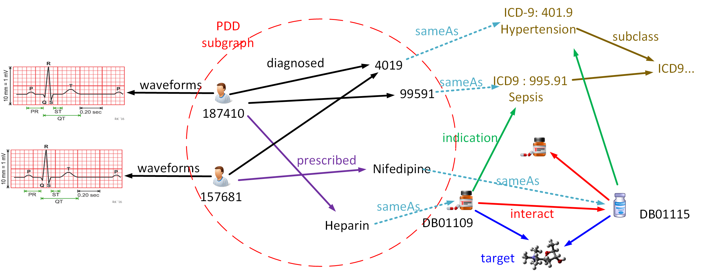

# 主页

http://kmap.xjtudlc.com/pdd

# 医疗诊断患病数据集

这是医疗数据集的显示工程。利用spring-boot做了url重定向，前端使用thymeleaf 作为MVC的model传递数据的接受者。

## 数据集介绍

该数据集是rdf数据集，关于理疗的，里面有诊断，有用药等，在线展示仅仅展示了其中一部分数据，下载`nt`格式的数据，可以获取完整的数据集。

利用这些数据集，你可以进行sparql查询，进行实体关系识别，进行医疗数据挖掘，等等。

所以重要的是该数据集，不是这个工程！

## What is PDD Graph 

What is PDD Graph (Patient-Disease-Drug Graph):

Electronic medical records contain multi-format electronic medical data that consist of an abundance of medical knowledge. Facing with patients symptoms, experienced caregivers make right medical decisions based on their professional knowledge that accurately grasps relationships between symptoms, diagnosis, and treatments. We aim to capture these relationships by constructing a large and high-quality heterogeneous graph linking patients, diseases, and drugs (PDD) in EMRs.

Specifically, we extract important medical entities from MIMIC-III (Medical Information Mart for Intensive Care III) and automatically link them with the existing biomedical knowledge graphs, including ICD-9 ontology and DrugBank. The PDD graph presented is accessible on the Web via the SPARQL endpoint, and provides a pathway for medical discovery and applications, such as effective treatment recommendations.

A subgraph of PDD is illustrated in the followng figure to betterunderstand the PDD graph.




## 数据集下载

[Home page to konw how to download](http://kmap.xjtudlc.com/pdd/)

服务器带宽有限，推荐去 Datahub 下载


## 本工程使用技术
不是指数据集工程。

- spring-boot
- thymeleaf
- jquery

## 效果展示

当你想要查询出一个实体时候，直接点击即可查看该实体有哪些东西。例如：

在我们发布的[Patient-Disease-Drug 数据集](http://kmap.xjtudlc.com/pdd/dataset.html?tab=query&ds=/pdd)里，可以在线查询，可以看到数据如下：


当我们点击其中某一条数据的时候，可以看到现在的系统展示的东西

[http://kmap.xjtudlc.com/pdd_data/resource/145834](http://kmap.xjtudlc.com/pdd_data/resource/145834) 


## 核心代码

```
    @GetMapping("/**/*")
    public String index(Model model , HttpServletRequest request) {
        String subject = String.valueOf(request.getRequestURL());
        model.addAttribute("subject",subject);
        return "/index";
    }
```

## License
[](http://creativecommons.org/licenses/by/4.0/) This work is licensed under a [Creative Commons Attribution 4.0 International License](http://creativecommons.org/licenses/by/4.0/).
